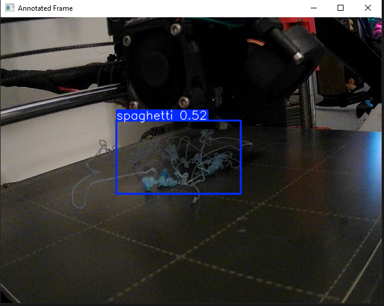

# spaghetti-detection
## Final Project: Phase 1
The work thus far is a proof of concept that the goals of the project can be accomplished within the time frame.

### train_valid_split.py
This file helps divide the images into training and validation

### train_script.py
This file very basically trains a YOLO model. Currently I have a very simple, and inaccurate, model
trained for detecting spaghetti failures in 3d printing.

### shutdown.py
This file is the proof of functionality. This file is what communicates with my printer server.
I was able to set up my printer to be able to talk to my computer on a locally hosted web server. 
I can check the status of the printer as well as send commands like cancel, pause, and resume.
This file is also able to access my camera. I mounted my web cam to the side of the printer so I can periodically capture the printing process.
After some manual placement of 'spaghetti' on my print bed
the model was finally able to detect and error and send the shutdown command to the printer

## Phase 2
Time on this phase was spent on training the model. Results of this training aren't reflected in the code. I decided to find more datasets that were fitting to my model to have more data to train.

### Code modifications
The only changes to the source code for this phase are found in shutdown.py. I added LOG_MODE feature that helps me monitor the live performance of my model. This runs the shutdown code as normal, but instead logs the results by saving the raw image and annotated image for me to analyze. When in LOG_MODE the printer is prevented from sending the shutdown command to the printer so I can gather more information and images from a failed print. 